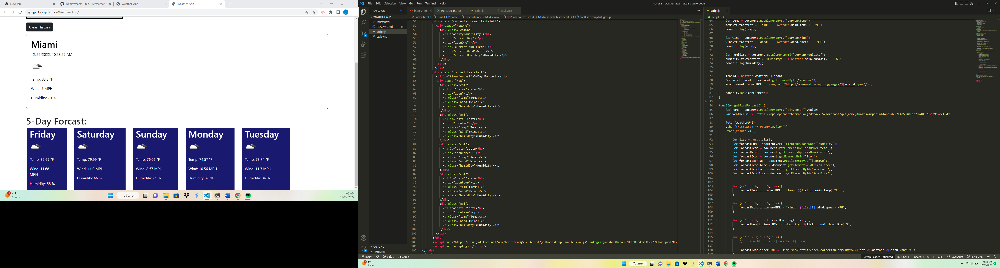
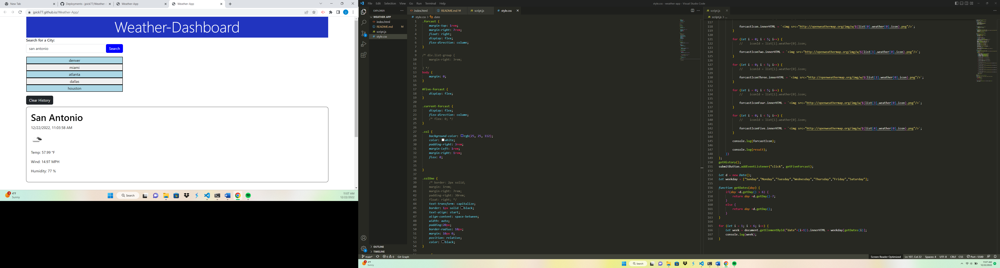

# Description
For this challenge, I wanted to create a website where a user could input a city name, and the current weather plus a five-day forecast would appear for that city. I used bootstrap and flexbox for the styling and HTML setup. I then used a fetch request with JavaScript to get data from a web API called open weather map API. I then used two different APIs from the open weather map one being current weather, then I used a five-day forecast API that they provided. The hardest challenge for me was getting the days of the week to appear for the five-day forecast. As well as converting the date from Unix to a normal date format. Then I created several for loops specifying how much information I wanted to display. And finally, I was able to log the past city searches to local storage so the user could see what they previously searched for.

# Installation
I used Bootstrap, Flexbox, jQuery, and JavaScript to design and display a functioning Weather-Application.

# Link to Deployed Page
https://jpick77.github.io/Weather-App/

# Screenshot of Code and Website

